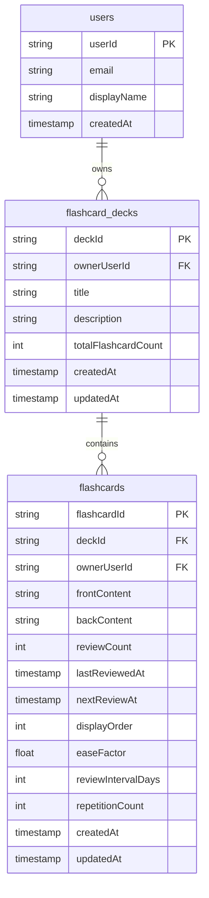

# Xác định yêu cầu của app

## Trước khi code
 - App làm gì
 - Ai dùng
 - Web hay mobile
 - CRUD gì
 - Có login không
 - Realtime không
 - Upload file không
## Chức năng chính trong app
### 1. Authentication
- Đăng ký bằng Email/Password
- Đăng nhập bằng Email/Password
- Đăng xuất
### 2. Quản lý bộ flashcard
- Tạo bộ flashcard
- Sửa bộ flashcard
- Xóa bộ flashcard
- Xem danh sách bộ flashcard

Ví dụ:
- IELTS
- TOEIC
- Daily English
### 3. Quản lý từ vựng trong flashcard
- Thêm từ vựng
- Sửa từ vựng
- Xóa từ vựng
- Xem danh sách từ vựng
- Import từ file docs
### 4. Học bằng flashcard
- Lật thẻ để xem nghĩa
- Chuyển sang từ tiếp theo
- Chuyển về từ trước
- Ôn tập tổng hợp tất cả thẻ đến hạn hôm nay
## Thiết kế database

## Chọn stack
- Frontend: Flutter
- Backend: Dart
- Database: Firebase
## Thiết kế API
## Xây backend
## Xây frontend
## Kết nối frontend + backend
## Authentication
## Testing
## Deploy
